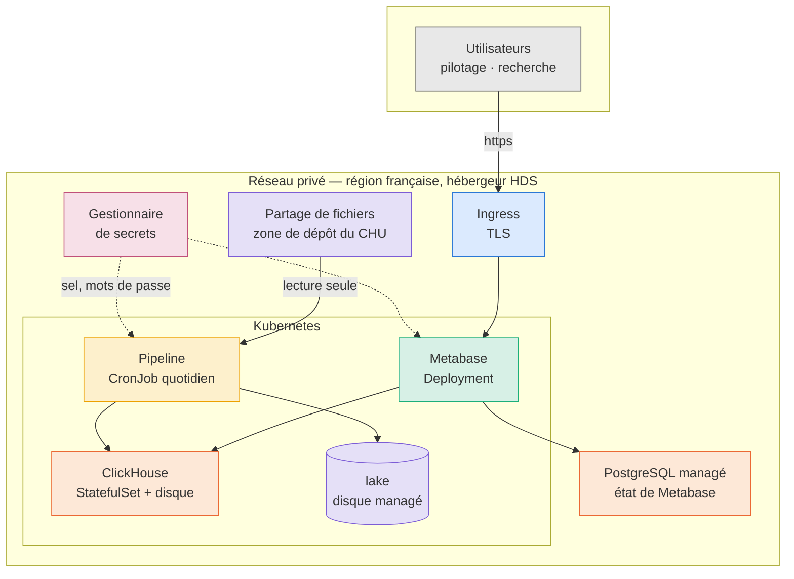
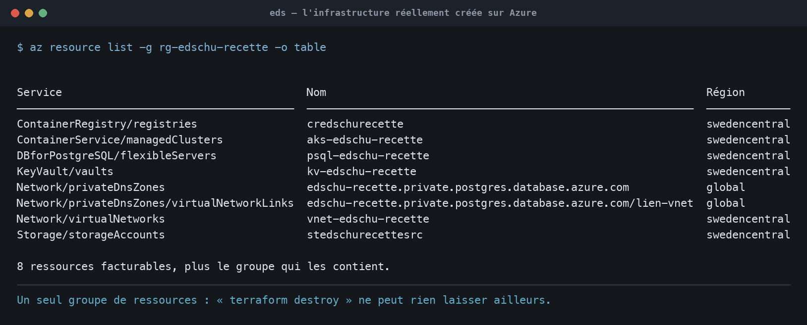
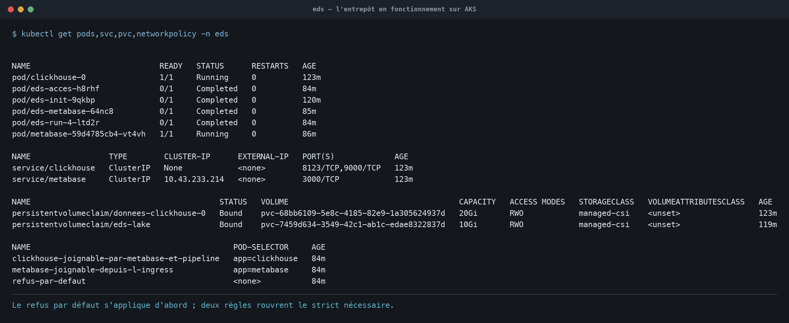
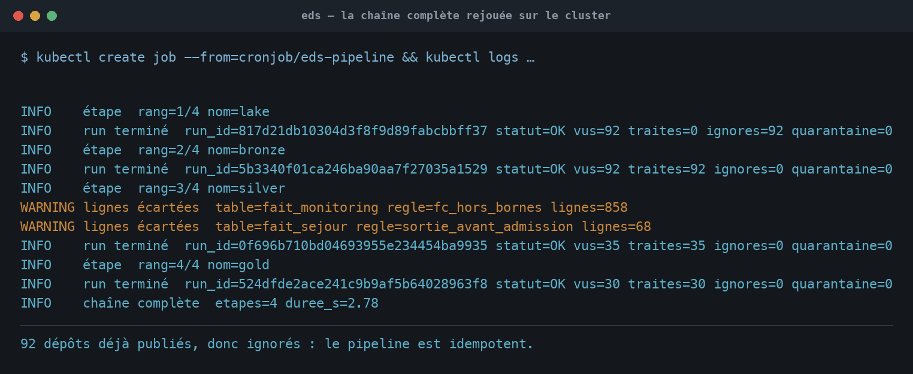
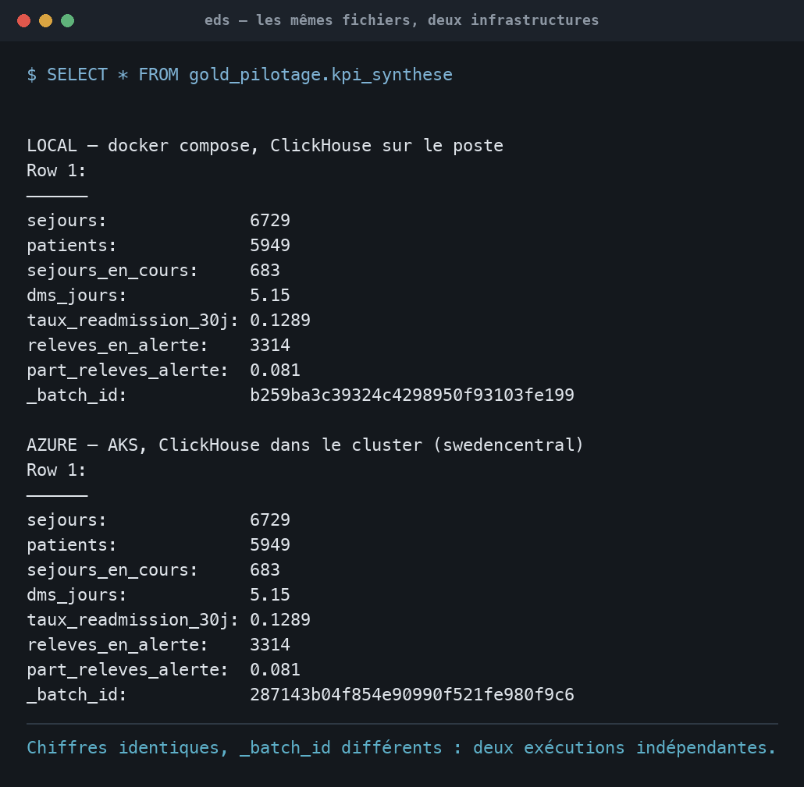
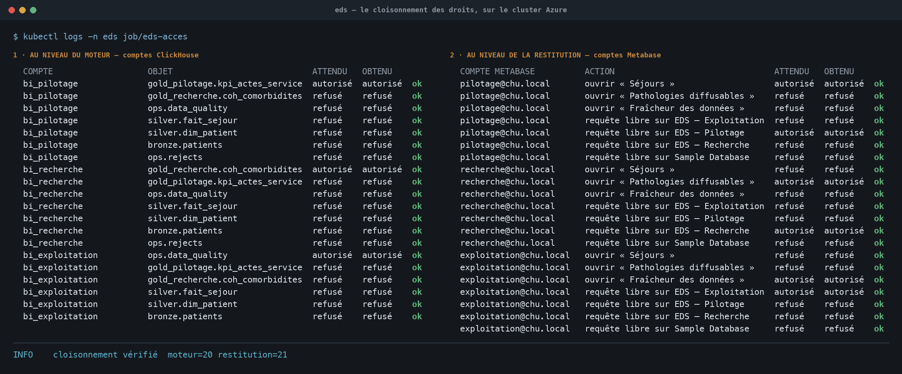
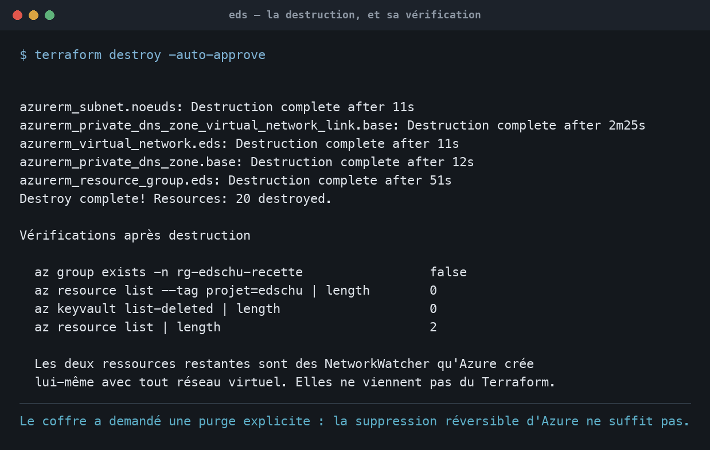

# Passage au cloud

CHU · Entrepôt de Données de Santé · Partie 3 — hébergement

Ce chapitre décrit l'infrastructure cible, ce qu'elle change au projet, et
surtout ce qu'elle ne change pas. Le code correspondant est dans `infra/`,
et se vérifie sans compte cloud par `make infra`.

- [1. Pourquoi le HDS commande tout](#1-pourquoi-le-hds-commande-tout)
- [2. L'architecture cible](#2-larchitecture-cible)
- [3. La zone de dépôt](#3-la-zone-de-dépôt)
- [4. Ce qui ne change pas](#4-ce-qui-ne-change-pas)
- [5. Ce qui change vraiment](#5-ce-qui-change-vraiment)
- [6. Comment cette infrastructure se vérifie](#6-comment-cette-infrastructure-se-vérifie)
- [7. Le plan de migration](#7-le-plan-de-migration)
- [8. Ce que cela coûte](#8-ce-que-cela-coûte)
- [9. Ce qui reste à faire](#9-ce-qui-reste-à-faire)

---

## 1. Pourquoi le HDS commande tout

Héberger des données de santé à caractère personnel pour le compte d'un
établissement impose, en France, de passer par un hébergeur certifié HDS
(article L1111-8 du Code de la santé publique). Ce n'est pas une exigence
d'infrastructure parmi d'autres : c'est celle qui élimine d'emblée la plupart
des offres, et qui doit donc être tranchée avant tout choix technique.

Trois conséquences en découlent, et elles se lisent directement dans `infra/` :

**La région est contrainte.** Une variable ne suffit pas, il faut une garantie :
`variables.tf` porte deux règles de validation. La première refuse toute région
hors de l'Espace économique européen — le RGPD interdit le transfert. La seconde
resserre l'étau dès que `environnement` vaut `production` : seules
`francecentral` et `francesouth` sont alors acceptées, parce que la certification
HDS de Microsoft ne couvre que ces deux régions. Un déploiement de production mal
paramétré échoue au lieu de sortir les données du territoire.

**La certification porte sur des services, pas sur un fournisseur.** Un
hébergeur certifié ne l'est pas pour l'intégralité de son catalogue. Le périmètre
exact doit être vérifié service par service au moment de contracter — c'est un
point de vigilance contractuel, que ce document signale sans pouvoir le trancher.

**Le chiffrement au repos n'est plus optionnel.** Il s'applique aux disques
managés qui portent l'entrepôt, au partage où le CHU dépose, et à la base
applicative de Metabase — y compris à celle-ci, qui ne contient pourtant aucune
donnée de santé : la liste des comptes qui accèdent à un entrepôt mérite la même
protection que l'entrepôt.

### Ce que la démonstration ne peut pas tenir : la région

Ce garde-fou a immédiatement produit son effet, et pas celui qu'on attendait :
il nous a interdit de déployer.

La souscription « Azure for Students » qui porte la démonstration applique une
politique `sys.regionrestriction` — « Allowed resource deployment regions » — qui
n'autorise que cinq régions : `germanywestcentral`, `spaincentral`,
`polandcentral`, `uaenorth` et `swedencentral`. Aucune région française.
Toute création en France est refusée par Azure lui-même :

```
Error: creating Flexible Server: unexpected status 403 (403 Forbidden)
RequestDisallowedByAzure: Resource 'psql-edschu-recette' was disallowed by Azure:
This policy maintains a set of best available regions where your subscription
can deploy resources.
```

Des cinq régions permises, une seule était utilisable :

| Région | Verdict |
| --- | --- |
| `uaenorth` | Hors EEE. Écartée sans discussion. |
| `spaincentral` | Tous les gabarits en `NotAvailableForSubscription`. |
| `germanywestcentral` | Aucun gabarit de la famille B. |
| `polandcentral` | Non retenue, plus éloignée à service égal. |
| `swedencentral` | `Standard_B2s_v2` disponible, 6 vCPU de quota. Retenue. |

La démonstration se déploie donc à Stockholm, et l'écart tient en une ligne,
dans `infra/terraform/terraform.tfvars`, entourée du raisonnement ci-dessus.

Il faut être précis sur ce qui est perdu et ce qui ne l'est pas. Stockholm est
dans l'EEE : aucun transfert hors Union, le RGPD reste tenu. Ce qui tombe,
c'est la certification HDS, dont le périmètre se limite aux deux régions
françaises. Sur les données fictives du sujet, l'écart est sans conséquence. Sur
de vraies données de patients, il serait rédhibitoire — et c'est exactement ce
que la seconde validation refuse dès que l'environnement passe en production.

Cela mérite d'être dit franchement, parce que c'est la leçon la plus utile de ce
chapitre : la contrainte réglementaire s'est révélée plus difficile à satisfaire
que la contrainte technique. Monter un cluster Kubernetes ne pose pas de
problème ; le monter au bon endroit, si. Un CHU qui contractualiserait pour de
vrai rencontrerait la même difficulté sous une autre forme — non pas une
politique de souscription étudiante, mais la disponibilité réelle des services
certifiés dans le périmètre HDS de son hébergeur, service par service. La
démonstration bute sur une version miniature du problème réel.

## 2. L'architecture cible



**ClickHouse n'a aucune adresse publique.** Il n'est joignable que depuis
l'intérieur du cluster, et seulement par Metabase et le pipeline — une politique
réseau le garantit indépendamment des mots de passe. C'est une troisième
barrière de cloisonnement, qui s'ajoute aux comptes du moteur et aux
collections Metabase.

## 3. La zone de dépôt

C'est l'endroit le plus sensible de tout le système, et il mérite d'être
traité à part.

Le CHU y dépose ses exports quotidiens, qui portent `nir`, `nom`, `prenom` et
`birth_date` en clair. C'est le seul endroit de la chaîne où une
ré-identification est possible : tout ce qui se trouve en aval a déjà traversé
la pseudonymisation à l'entrée du lake.

**Et c'est précisément ce qui rend l'ensemble défendable.** Puisque l'identité
disparaît dès la première zone que nous maîtrisons, sécuriser tout l'entrepôt
revient à sécuriser un seul endroit. Le reste — bronze, silver, gold, les
tableaux de bord, les sauvegardes — ne contient rien d'identifiant, et une fuite
y serait sans gravité au sens du RGPD.

### Où le CHU dépose, en pratique

| schéma | ce que ça implique |
|---|---|
| Le CHU reste chez lui, l'EDS vient chercher | l'hôpital exporte sur son propre réseau, le pipeline lit à travers une liaison privée. Aucune donnée identifiante ne transite par l'internet public, et l'hôpital garde la main sur ce qu'il expose. |
| Le CHU dépose dans une zone d'atterrissage cloud | un partage ou un conteneur dédié, sans accès public, dans le périmètre HDS. Plus simple à exploiter, mais les identités vivent désormais chez l'hébergeur. |

Le premier est le plus courant en France, et le plus facile à défendre devant un
délégué à la protection des données. Le second est celui que cette
infrastructure décrit, parce qu'elle doit pouvoir se déployer seule.

### Un compte de stockage séparé, et pourquoi

`infra/terraform/zone_de_depot.tf` crée un compte distinct de celui du lake.
Ce n'est pas de la coquetterie : qui peut lire l'entrepôt ne doit pas pouvoir
lire les identités, et une séparation des droits n'a de sens que si elle porte
sur des objets distincts. Un simple dossier dans le compte du lake partagerait
ses droits.

Le partage est monté en lecture seule par le pipeline, avec des permissions
qui interdisent l'écriture jusque dans le système de fichiers du conteneur —
`dir_mode=0555, file_mode=0444`. Le conteneur ne peut pas altérer la source,
même par erreur de programmation.

### La rétention doit être COURTE, et c'est contre-intuitif

Le lake conserve dix ans. La zone de dépôt devrait conserver quelques jours.

Une fois le fichier ingéré et pseudonymisé, le brut n'a plus de raison
d'exister : le garder revient à conserver des identités dont on n'a plus
l'usage, ce que le principe de minimisation interdit. C'est l'inverse du
réflexe habituel, qui pousse à tout garder « au cas où ».

**Cette purge n'est pas implémentée**, et il faut le dire. Azure Files n'offre
pas de règle de cycle de vie déclarative : la purge doit être portée par une
tâche planifiée, qui reste à écrire. C'est une dette assumée — la nommer ici, et
dans le fichier Terraform, évite qu'elle se perde.

Une variante mérite d'être étudiée en production : un conteneur objet avec SFTP
activé plutôt qu'un partage SMB. Le CHU y pousserait par SFTP, et la rétention
redeviendrait déclarative — au prix d'un montage plus complexe côté Kubernetes.

### Ce que cette zone impose par ailleurs

- **Tracer chaque lecture.** C'est le seul endroit où la ré-identification est
  possible ; savoir qui y accède, et quand, fait partie du dispositif.
- **Ne jamais l'exposer publiquement.** Ni le compte, ni le partage.
- **La traiter comme un périmètre à part** dans l'analyse d'impact : c'est la
  zone qui porte le risque, les autres n'en portent presque plus.


## 4. Ce qui ne change pas

C'est la partie la plus importante du chapitre, et elle se démontre.

**Toute la configuration tient dans 18 variables d'environnement.** Le code ne
contient aucune adresse en dur : les deux occurrences de `localhost` sont des
valeurs par défaut de `os.getenv`, remplacées dès qu'une variable est
fournie.

**La portabilité est déjà éprouvée, tous les jours.** Le conteneur `scheduler`
de `docker-compose.yml` tourne avec `CLICKHOUSE_HOST=clickhouse`,
`EDS_SOURCE_PATH=/filestorage` et `EDS_LAKE_PATH=/app/lake` — un hôte et deux
chemins qui n'existent nulle part sur le poste de développement. Aucune ligne de
code ne distingue ce cas du cas cloud.

| composant | ce qu'il faut changer |
|---|---|
| Connexion au moteur | `CLICKHOUSE_HOST`, `CLICKHOUSE_SECURE=true`, port 8443 |
| Restitution | `METABASE_URL` |
| Secrets | injectés par Kubernetes au lieu d'un fichier `.env` |
| Ordonnancement | un `CronJob` au lieu d'APScheduler |
| Code Python | rien |

`CLICKHOUSE_SECURE` bascule la liaison en TLS sans toucher au code : le client
lit cette variable et adapte son transport.

## 5. Ce qui change vraiment

### L'ordonnancement passe au cluster

APScheduler tenait la cadence dans un processus qui devait rester vivant.
Kubernetes la tient lui-même, et le conteneur ne vit plus que le temps d'une
exécution — ce qui supprime la question du redémarrage. Les trois réglages du
planificateur local ont chacun leur équivalent :

| en local | sur Kubernetes | ce que cela garantit |
|---|---|---|
| `max_instances = 1` | `concurrencyPolicy: Forbid` | une exécution à la fois |
| `coalesce = true` | `startingDeadlineSeconds` | un seul rattrapage, pas un par créneau perdu |
| `misfire_grace_time = 3600` | `startingDeadlineSeconds: 3600` | un démarrage tardif rattrape le créneau du jour |

Le verrou de fichier reste en place à l'intérieur du conteneur : il continue de
garantir qu'une exécution lancée à la main ne croise pas la planifiée.

### Metabase change de base applicative

En local, Metabase garde son état dans un H2 posé sur un volume. C'est
acceptable pour une démonstration, pas sur Kubernetes où un pod peut être
déplacé à tout moment : H2 ne supporte ni le déplacement à chaud ni deux
écrivains, et la panne se manifeste par une base corrompue plutôt que par une
erreur claire. L'état passe donc sur une base PostgreSQL managée.

Cette base ne contient aucune donnée de santé — seulement des définitions de
cartes, des comptes et des permissions. Le chiffrement au repos y est activé
malgré tout : la liste des comptes qui accèdent à un entrepôt de santé mérite la
même protection que l'entrepôt.

### Les journaux sont bornés

Sur l'installation locale, les journaux de ClickHouse pesaient 487 Mio pour
155 Mio de données — conséquence de centaines d'exécutions. Sur le cluster ils
vivent sur un volume éphémère borné à 2 Gio : ils ne sont pas précieux, et
sans borne ils rempliraient le disque avant l'entrepôt.

### Les secrets quittent le fichier `.env`

Le dossier annonçait cette limite : « en production, ce sel appartient à un
coffre, pas à un fichier `.env` ». C'est fait — les secrets sont déclarés dans
le gestionnaire, et injectés dans les pods.

Sept d'entre eux ne sont pas créés par Terraform du tout : il se contente de
les nommer, dans une sortie `secrets_a_deposer`, et `infra/deposer-secrets.sh`
les tire au sort puis les dépose. La raison tient en une phrase : le fichier
d'état de Terraform contient en clair tout ce qu'on lui confie. Y écrire le sel
de pseudonymisation reviendrait à le publier.

Deux exceptions sont assumées, parce qu'elles sont inévitables. Le mot de passe
de la base managée, que Terraform doit fournir à la création. Et la clé du
compte de stockage de la zone de dépôt, qu'il lit pour que le pilote CSI puisse
monter le partage. Tous deux figurent donc dans l'état, et la conséquence est
tirée plutôt qu'ignorée — l'état lui-même est un secret, il ne va pas dans git,
il vit dans un stockage distant chiffré, et son accès se traite comme celui de
la base.

Ces secrets sont neufs, et ne reprennent pas ceux du poste. Deux environnements
qui partagent un mot de passe n'en font plus qu'un, et un sel de
pseudonymisation commun rendrait les deux entrepôts corrélables — ce qui
ruinerait précisément la protection qu'il apporte.

## 6. Comment cette infrastructure se vérifie

Une infrastructure décrite mais invérifiable ne vaut guère mieux qu'un schéma.
Trois niveaux, du plus accessible au plus coûteux.

### Niveau 1 — sans compte, hors ligne

```bash
make infra
```

`terraform validate` confronte la configuration au schéma réel du
fournisseur : noms de ressources, attributs, types, blocs imbriqués.
`kubeconform` confronte les manifestes aux schémas de l'API Kubernetes. Ni l'un
ni l'autre ne demande de compte, et le second tourne en conteneur — rien à
installer.

Cette vérification mord, et cela a été éprouvé : un attribut Terraform mal
nommé et un `schedule` mal orthographié dans le `CronJob` font tomber la cible,
avec un message qui désigne la ligne.

**Ce qu'elle ne vérifie pas**, et qu'il faut dire : les chaînes libres. Les noms
de jeux de permissions IAM et les gabarits de nœuds n'existent que côté API ; la
validation en contrôle la syntaxe, pas l'existence.

### Niveau 2 — un plan, sans rien créer

`terraform plan` demande un compte mais ne crée aucune ressource et ne coûte
rien. Il confronte la configuration à l'API, donc il attrape précisément ce
que le niveau 1 laisse passer : gabarits inexistants, noms de rôles erronés,
quotas insuffisants.

**Exécuté sur la souscription du projet**, le plan aboutit :

```
Plan: 20 to add, 0 to change, 0 to destroy.
```

| ressource | rôle |
|---|---|
| `resource_group` | tout l'entrepôt y vit, rien ailleurs |
| `virtual_network` + 2 × `subnet` | le réseau privé, dont un sous-réseau délégué à la base |
| `kubernetes_cluster` | 2 nœuds, 4 vCPU sur les 6 du quota |
| `container_registry` | l'image du pipeline |
| `key_vault` + 2 × `key_vault_secret` | le coffre, et les seuls secrets que Terraform connaisse |
| `storage_account` + `share` | la zone de dépôt, sur un compte séparé |
| `postgresql_flexible_server` + `database` + `configuration` | l'état de Metabase |
| `private_dns_zone` + `virtual_network_link` | la résolution du nom privé de la base |
| 3 × `role_assignment` | moindre privilège : lire le coffre, tirer l'image |
| `random_password` | le mot de passe de la base, généré |

Ce que ce plan démontre et que la validation hors ligne ne pouvait pas : les
noms de rôles — `Key Vault Secrets User`, `AcrPull` — existent, le gabarit
`Standard_B2s_v2` est disponible dans la région retenue, et la souscription
accepte chacune de ces créations.

Ce qu'il ne démontre pas, et c'est instructif : le plan aboutissait tout aussi
bien en `francecentral`, où pas une ressource n'a pu être créée. Une politique
de souscription ne s'évalue qu'à l'écriture. Le niveau 2 attrape ce que le
niveau 1 laisse passer, mais il laisse passer à son tour ce que seul le
niveau 3 révèle.

### Niveau 3 — déployer, capturer, détruire

`apply`, puis captures, puis `destroy`. Le journal de la destruction est
lui-même une pièce : il prouve qu'aucune ressource n'est restée orpheline, ni
aucun disque portant des données de santé.

> **Sur l'accès en direct.** Ouvrir l'environnement déployé à un tiers serait
> contradictoire avec le sujet même de ce projet. Une infrastructure de
> démonstration portant des données de santé se détruit après usage ; c'est ce
> qu'on ferait pour un vrai CHU, et c'est ce que nous recommandons.

Ce niveau a été joué. Voici ce qui a réellement existé sur Azure :



Huit ressources, un seul groupe, une seule région. Les deux entrées `global`
sont la zone DNS privée et son rattachement au réseau : elles n'ont pas de
région parce qu'elles n'hébergent aucune donnée.



Les deux volumes sont des disques managés — celui de ClickHouse et celui du
lake. Les services sont en `ClusterIP` : aucune adresse externe, ni pour le
moteur ni pour la restitution. Le refus par défaut porte sur tous les pods
(`<none>` en sélecteur) et deux règles seulement rouvrent le nécessaire.

La chaîne elle-même se rejoue à l'identique, et son idempotence se lit dans
les chiffres :



Les 92 dépôts sont vus puis ignorés à l'étape lake : ils ont déjà été
publiés, rien n'est réécrit. Seules les couches reconstruites à chaque passage —
silver et gold — refont leur travail. La chaîne entière tient en 2,78 secondes.

**La vérification qui décide de tout** reste la comparaison des indicateurs.
Le pipeline est déterministe et reconstruit silver et gold à chaque passage :
les mêmes fichiers doivent donner les mêmes chiffres, sur une autre
infrastructure, dans un autre pays, sur une autre architecture processeur.



Les sept indicateurs coïncident. Les `_batch_id` diffèrent, ce qui écarte
l'hypothèse d'une même base interrogée deux fois : ce sont bien deux exécutions
indépendantes. Un écart, ici, aurait signalé une différence d'environnement — et
non une différence de données.

Le cloisonnement, enfin, se rejoue à l'identique sur le cluster :



Quarante et un contrôles, vingt sur le moteur et vingt et un sur la restitution,
tous conformes à l'attendu. C'est le même chiffre qu'en local — la garantie ne
tient pas au `docker-compose`, elle tient aux droits eux-mêmes.

#### Ce que ces images établissent, et ce qu'elles n'établissent pas

Il faut être honnête sur leur valeur : aucune capture ne prouve qu'un
déploiement a eu lieu. Une image de `kubectl get pods` est du texte, et du
texte se fabrique. Nous n'invoquons donc pas ces quatre pièces comme des
preuves, et nous avons écarté pour la même raison une capture d'un tableau de
bord servi par le cluster : prise à travers un tunnel, elle affiche
`localhost:3000` et ne se distingue en rien de la même page servie en local.
Une pièce incapable de départager les deux hypothèses n'appuie pas la thèse,
elle l'affaiblit.

Ce qui rend ce chapitre vérifiable est ailleurs, et tient en trois points.

**L'infrastructure est du code, et il est dans le dépôt.** Personne n'a à nous
croire sur parole : `terraform validate` s'exécute hors ligne, `terraform plan`
confronte la description à l'API d'Azure, et un `apply` sur une autre
souscription reconstruit le même ensemble. C'est reproductible, ce qu'une
capture n'est jamais. C'est aussi la raison pour laquelle l'*infrastructure as
code* est ici le livrable, et les images de simples illustrations.

**Les pièces se recoupent.** Les identifiants de volumes, les suffixes de pods,
le `_batch_id` que l'on retrouve d'une image aux journaux du pipeline, les
identifiants de ressources : un jeu cohérent coûte bien davantage à fabriquer
qu'une image isolée.

**Les difficultés rencontrées sont, paradoxalement, la meilleure preuve.** Les
cinq défauts décrits ci-après — un `fsGroup` manquant, une extension refusée par
Azure, un conflit entre accès public et réseau virtuel — ne s'inventent pas.
Ils portent la marque d'un système qu'on a réellement fait tourner, et c'est une
trace textuelle, non photographique.

#### La destruction, et ce qu'elle a appris

L'infrastructure a été détruite après les captures, comme annoncé.



Vingt ressources détruites, le groupe disparu, aucune ressource portant
l'étiquette du projet dans toute la souscription. Les deux ressources qui
subsistent sont des `NetworkWatcher` qu'Azure crée lui-même dès qu'un réseau
virtuel existe ; elles ne viennent pas de notre description et Azure les recrée
de toute façon.

**Mais `terraform destroy` n'avait pas tout détruit**, et c'est le dernier
enseignement de ce chapitre. Azure Key Vault applique une suppression
réversible obligatoire : le coffre restait récupérable pendant quatre-vingt-dix
jours, avec ses neuf secrets — dont le sel de pseudonymisation. Il a fallu une
purge explicite :

```
az keyvault purge --name kv-edschu-recette --location swedencentral
```

Cette mécanique met deux exigences en tension, et le projet doit choisir laquelle
prime. La suppression réversible protège d'une destruction accidentelle, ce qui
est manifestement souhaitable pour un coffre : Azure ne permet d'ailleurs plus
de la désactiver. Mais le RGPD porte un droit à l'effacement, et un sel de
pseudonymisation qui survit trois mois à la destruction de l'entrepôt qu'il
servait est précisément ce qu'un délégué à la protection des données relèverait.

Le curseur se règle par `purge_protection_enabled`. Nous l'avons laissé à
`false`, ce qui rend la purge possible — le bon choix pour une infrastructure de
démonstration qui doit pouvoir disparaître entièrement. En production,
l'inclination naturelle serait de le passer à `true` pour se prémunir d'une
suppression malveillante ; il faut alors savoir que la purge devient impossible
pendant quatre-vingt-dix jours, et que la procédure d'effacement d'un patient
ne peut donc pas reposer sur la destruction du coffre. Elle doit reposer sur la
rotation du sel, qui rend les pseudonymes anciens irréconciliables — ce que
`docs/EXPLOITATION.md` décrit déjà comme une opération lourde, et qui trouve ici
sa justification réglementaire.

C'est une conclusion inattendue pour un chapitre d'infrastructure : le geste
qui protège les données et celui qui les efface sont le même geste, réglé en
sens contraire.

### Ce que le déploiement a révélé, et que rien d'autre n'aurait trouvé

Les niveaux 1 et 2 déclaraient l'infrastructure valide. Elle l'était, au sens où
Terraform et kubeconform l'entendent. Le déploiement réel a pourtant mis au jour
cinq défauts, tous invisibles avant lui. Ils méritent d'être listés, parce
qu'ils délimitent exactement ce qu'une validation hors ligne peut promettre.

**1. Une clé de secret qui n'était pas un identifiant.** Le secret `eds-secrets`
était lu de deux façons incompatibles : par `envFrom`, qui transforme chaque clé
en variable d'environnement, et par `secretKeyRef`, qui accepte n'importe quel
nom. Les clés étaient nommées `clickhouse-admin-password` — parfait pour le
second usage, invalide pour le premier. Kubernetes n'émet aucune erreur : il
ignore silencieusement les clés qui ne sont pas des identifiants. Le pipeline
aurait démarré sans un seul secret. Les clés portent désormais le nom exact des
variables, et ce qui n'est pas secret est passé dans un `ConfigMap` distinct.

**2. Un `fsGroup` manquant.** Le pipeline tourne en `uid 10001`, et un disque
managé se monte `root:root` en `0755`. Les 92 dépôts ont échoué d'un coup, à la
première écriture. Le `StatefulSet` de ClickHouse portait bien un `fsGroup` ; le
pipeline l'avait oublié. Aucun schéma d'API ne peut détecter cela — le manifeste
était parfaitement valide.

**3. Une base managée publique et injoignable.** Le serveur PostgreSQL était
créé en accès public sans aucune règle de pare-feu : joignable par personne, et
exposé en principe. Deux défauts contradictoires dans la même ligne. La base est
passée en accès privé — sous-réseau délégué et zone DNS privée — ce qui n'est pas
un durcissement cosmétique : cette base porte la liste des comptes qui accèdent
à l'entrepôt, et sa publication contredisait l'argument de tout le reste. Azure
a d'ailleurs refusé la configuration intermédiaire, exigeant que l'accès public
soit explicitement désactivé plutôt que déduit.

**4. Une extension non autorisée.** Metabase pose l'extension `citext` au premier
démarrage. Azure n'autorise aucune extension par défaut. C'est une différence
entre un PostgreSQL managé et un PostgreSQL en conteneur que le développement
local ne peut pas révéler, par construction.

**5. Une dépendance circulaire entre les trois installations.** `eds metabase` a
besoin des comptes ClickHouse que crée `eds acces` ; la vérification du
cloisonnement Metabase par `eds acces` a besoin des comptes que crée
`eds metabase`. À la première installation, `eds acces` signale honnêtement
`cloisonnement Metabase non vérifié` et le second passage donne les 41 contrôles.
Ce n'est pas un défaut de code — la commande dégrade proprement — mais une
propriété de la séquence, qu'il faut connaître : l'installation demande deux
passages de `eds acces`, jamais un seul.

La leçon tient en une phrase : une infrastructure validée n'est pas une
infrastructure éprouvée. Les trois premiers défauts partagent un trait commun —
ils ne produisent pas d'erreur au déploiement, mais un silence, un délai
d'attente ou un refus de permission au premier usage réel. C'est précisément la
catégorie de panne qu'un `terraform validate` ne verra jamais, et c'est pourquoi
le niveau 3 n'est pas une formalité de fin de parcours.

## 7. Le plan de migration

Chaque étape est réversible et laisse l'installation locale intacte.

| # | étape | vérification |
|---|---|---|
| 1 | Contracter chez un hébergeur certifié HDS, vérifier le périmètre par service | contrat |
| 2 | `terraform apply` — réseau, zone de dépôt, secrets, cluster, registre | `terraform plan` vide ensuite |
| 3 | `infra/deposer-secrets.sh` — tirer les secrets et remplir le coffre | 9 secrets dans le coffre |
| 4 | Construire et pousser l'image en `linux/amd64` | `docker pull` depuis le cluster |
| 5 | `infra/secrets-kubernetes.sh` — porter les secrets du coffre au cluster | 3 secrets dans l'espace de noms |
| 6 | Appliquer les manifestes, dans l'ordre | `kubectl get pods` |
| 7 | `eds init`, `eds acces`, `eds metabase`, puis `eds acces` à nouveau | 41 contrôles de cloisonnement |
| 8 | Charger un premier dépôt, comparer les indicateurs au local | les sept KPI identiques |
| 9 | Activer le `CronJob` | une exécution nocturne journalisée |

**L'étape 8 est celle qui compte.** Le pipeline étant déterministe et
reconstruisant silver et gold à chaque passage, les mêmes fichiers doivent
produire exactement les mêmes chiffres — 6 729 séjours, DMS 5,15 j, 3 314
relevés en alerte. Un écart signalerait une différence d'environnement, pas une
différence de données.

## 8. Ce que cela coûte

Les tarifs changent : ce chapitre donne la structure du coût plutôt que des
montants qui seraient périmés à la lecture.

| poste | ce qui le détermine | ordre |
|---|---|---|
| Nœuds Kubernetes | 2 nœuds en permanence | dominant |
| Base managée | un nœud, doublé en production | notable |
| Stockage | disque du lake et partage de dépôt — 3,3 Mo aujourd'hui | négligeable |
| Gestionnaire de secrets | quelques secrets | négligeable |
| Sortie réseau | consultation des tableaux de bord | faible |

**Le constat le plus utile n'est pas un montant.** Le pipeline s'exécute en
une seconde et demie par jour : son propre calcul est gratuit à toute échelle
raisonnable. Ce qui coûte, c'est de garder le moteur et la restitution
disponibles le reste du temps — soit 99,998 % d'un cluster dimensionné pour
une charge qui n'arrive jamais.

Trois pistes en découlent, par ordre de gain :

1. **Mutualiser le cluster** avec d'autres applications du CHU. C'est de loin la
   plus rentable : l'entrepôt paie alors sa part et non un cluster entier.
2. **Réduire le pool hors heures ouvrées.** La recherche et le pilotage se
   consultent en journée ; le pipeline tourne à 2 h et pourrait réveiller le
   cluster.
3. **Ne pas dimensionner sur le pipeline.** Il ne dicte rien : c'est la
   consultation simultanée des tableaux de bord qui décide de la taille.

## 9. Ce qui reste à faire

### Porter le lake sur stockage objet — non fait, et pourquoi

**Aujourd'hui le lake n'est PAS sur du stockage objet.** Il vit sur un disque
managé attaché au cluster : un vrai système de fichiers, où `eds/lake.py` fonctionne sans modification. C'est ce qui
permet de déployer sans toucher au code.

**Nous n'avons délibérément pas provisionné de stockage objet inutilisé.** Une
infrastructure décrit ce qui tourne ; provisionner un conteneur que rien n'écrit
créerait une ressource facturée, sauvegardée et auditée pour rien — et
laisserait croire que le lake y vit.

**Ce choix a une conséquence qu'il faut assumer.** Un disque managé se monte en
accès exclusif : il n'est attaché qu'à un nœud à la fois. Le pipeline est donc
épinglé à un nœud, et la perte de ce nœud rend le lake indisponible jusqu'à
ce que le volume soit rattaché ailleurs.

À la volumétrie observée — 3,2 Mo de lake — c'est un risque acceptable : le lake
se reconstruit intégralement depuis la source du CHU, qui vit ailleurs, et la
reconstruction prend une seconde et demie. Mais c'est bien la raison principale
de passer au stockage objet le jour venu, davantage que la durabilité ou le
coût : découpler le pipeline d'un nœud.

#### Pourquoi ne pas simplement monter un conteneur objet comme un disque

C'est la fausse bonne idée, et elle mérite d'être écartée explicitement. Azure
sait présenter un conteneur objet comme un système de fichiers ; le pipeline
tournerait alors sans une ligne de changement.

Il casserait pourtant silencieusement la garantie sur laquelle repose le
lake. Ces passerelles émulent le renommage par une copie suivie d'une
suppression — donc pas atomiquement. Un fichier pourrait apparaître sous son
nom définitif alors que sa copie n'est pas terminée, et `est_publie()`
conclurait à tort qu'il est complet. Le pipeline ne lèverait aucune erreur : il
chargerait un fichier tronqué.

Une garantie que l'on croit tenir et qui ne tient plus est pire qu'une garantie
absente. Le portage doit donc passer par le client objet, qui rend
l'atomicité nativement — et non par un montage qui la simule.

#### Le jour où le portage aura lieu, les `.partiel` disparaîtront

Ce qui suit décrit une situation future. Tant que le lake est un disque, le
mécanisme actuel reste en place et reste nécessaire.

Aujourd'hui, une copie s'écrit sous `<nom>.partiel` puis est renommée. Le
renommage étant atomique, un fichier présent sous son nom définitif est
forcément complet, et une copie interrompue laisse un résidu que `eds lake`
efface au démarrage. C'est ce qui tourne, en local comme sur le cluster.

Le jour où le lake passera en stockage objet, cette précaution deviendra
inutile — et c'est une bonne nouvelle, pas une difficulté :

| | système de fichiers | stockage objet |
|---|---|---|
| écriture | visible au fur et à mesure | invisible jusqu'à la validation |
| publication | renommage atomique | la validation *est* atomique |
| écriture interrompue | laisse un fichier tronqué | ne laisse rien de visible |
| résidus à nettoyer | les `.partiel` | aucun |

Un envoi en une requête remplace le blob entièrement : un lecteur voit l'ancien
ou le nouveau, jamais un état intermédiaire. Un envoi en blocs, pour les gros
fichiers, dépose des blocs qui n'apparaissent pas tant qu'ils ne sont pas
validés, et cette validation est elle aussi atomique. Des blocs jamais validés
restent invisibles au listage et sont purgés par le fournisseur au bout de sept
jours.

Autrement dit, la garantie que le lake construit aujourd'hui à la main — *ce qui
porte son nom définitif est complet* — serait alors rendue par le stockage
lui-même. On écrirait directement sous le nom final, et `nettoyer_residus()`
n'aurait plus rien à nettoyer.

#### Ce qui reste réellement à faire

- **La vérification d'existence devient un appel réseau.** C'est elle qui rend
  un lake purgé auto-réparable ; elle passe d'un `stat` local à une requête, avec
  la latence et le mode de panne que cela ajoute.
- **Une dépendance s'ajoute** au projet, qui n'en compte aujourd'hui que six
  directes.
- **Une écriture concurrente mérite d'être bornée.** Le verrou de fichier ne
  protège que d'un second processus sur la même machine ; une condition
  d'écriture — n'écrire que si l'objet n'existe pas — rendrait la publication
  sûre même entre deux nœuds.

En attendant, le lake reste sur un volume persistant — ce qui fonctionne, et où
le mécanisme des `.partiel` garde tout son sens, puisqu'il s'agit d'un vrai
système de fichiers.

### Ce que nous ne recommandons pas

**Migrer ClickHouse vers une base managée.** Aucun hébergeur français certifié
HDS n'en propose. Les alternatives managées imposeraient de réécrire les
transformations, qui représentent l'essentiel de la valeur du projet.

**Multiplier les répliques de ClickHouse** avant d'en avoir le besoin. Une seule
instance tient largement la volumétrie observée, et la réplication ajoute une
classe entière de pannes.

**Ouvrir l'API du cluster.** L'ACL ferme l'accès quand aucune adresse n'est
déclarée. C'est délibérément l'inverse du défaut habituel : sur un entrepôt de
santé, un oubli doit fermer.
