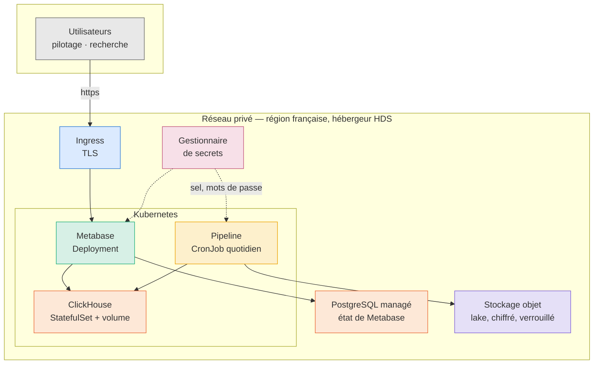

# Passage au cloud

CHU · Entrepôt de Données de Santé · Partie 3 — hébergement

Ce chapitre décrit l'infrastructure cible, ce qu'elle change au projet, et
surtout ce qu'elle **ne** change pas. Le code correspondant est dans `infra/`,
et se vérifie sans compte cloud par `make infra`.

- [1. Pourquoi le HDS commande tout](#1-pourquoi-le-hds-commande-tout)
- [2. L'architecture cible](#2-larchitecture-cible)
- [3. Ce qui ne change pas](#3-ce-qui-ne-change-pas)
- [4. Ce qui change vraiment](#4-ce-qui-change-vraiment)
- [5. Comment cette infrastructure se vérifie](#5-comment-cette-infrastructure-se-vérifie)
- [6. Le plan de migration](#6-le-plan-de-migration)
- [7. Ce que cela coûte](#7-ce-que-cela-coûte)
- [8. Ce qui reste à faire](#8-ce-qui-reste-à-faire)

---

## 1. Pourquoi le HDS commande tout

Héberger des données de santé à caractère personnel pour le compte d'un
établissement impose, en France, de passer par un **hébergeur certifié HDS**
(article L1111-8 du Code de la santé publique). Ce n'est pas une exigence
d'infrastructure parmi d'autres : c'est celle qui élimine d'emblée la plupart
des offres, et qui doit donc être tranchée **avant** tout choix technique.

Trois conséquences en découlent, et elles se lisent directement dans `infra/` :

**La région est contrainte.** Une variable ne suffit pas, il faut une garantie :
`variables.tf` refuse toute région hors de France par une règle de validation.
Un déploiement mal paramétré échoue au lieu de sortir les données du territoire.

**La certification porte sur des services, pas sur un fournisseur.** Un
hébergeur certifié ne l'est pas pour l'intégralité de son catalogue. Le périmètre
exact doit être vérifié service par service au moment de contracter — c'est un
point de vigilance contractuel, que ce document signale sans pouvoir le trancher.

**Le chiffrement et la traçabilité ne sont plus optionnels.** Le stockage objet
impose le chiffrement au repos côté serveur, la base managée l'active, et le
verrouillage objet empêche qu'un dépôt du CHU soit modifié après écriture.

## 2. L'architecture cible



**ClickHouse n'a aucune adresse publique.** Il n'est joignable que depuis
l'intérieur du cluster, et seulement par Metabase et le pipeline — une politique
réseau le garantit indépendamment des mots de passe. C'est une **troisième
barrière** de cloisonnement, qui s'ajoute aux comptes du moteur et aux
collections Metabase.

## 3. Ce qui ne change pas

C'est la partie la plus importante du chapitre, et elle se démontre.

**Toute la configuration tient dans 18 variables d'environnement.** Le code ne
contient aucune adresse en dur : les deux occurrences de `localhost` sont des
**valeurs par défaut** de `os.getenv`, remplacées dès qu'une variable est
fournie.

**La portabilité est déjà éprouvée, tous les jours.** Le conteneur `scheduler`
de `docker-compose.yml` tourne avec `CLICKHOUSE_HOST=clickhouse`,
`EDS_SOURCE_PATH=/filestorage` et `EDS_LAKE_PATH=/app/lake` — un hôte et deux
chemins qui n'existent nulle part sur le poste de développement. Aucune ligne de
code ne distingue ce cas du cas cloud.

| composant | ce qu'il faut changer |
|---|---|
| Connexion au moteur | `CLICKHOUSE_HOST`, `CLICKHOUSE_SECURE=true`, port 8443 |
| Restitution | `METABASE_URL` |
| Secrets | injectés par Kubernetes au lieu d'un fichier `.env` |
| Ordonnancement | un `CronJob` au lieu d'APScheduler |
| **Code Python** | **rien** |

`CLICKHOUSE_SECURE` bascule la liaison en TLS sans toucher au code : le client
lit cette variable et adapte son transport.

## 4. Ce qui change vraiment

### L'ordonnancement passe au cluster

APScheduler tenait la cadence dans un processus qui devait rester vivant.
Kubernetes la tient lui-même, et le conteneur ne vit plus que le temps d'une
exécution — ce qui supprime la question du redémarrage. Les trois réglages du
planificateur local ont chacun leur équivalent :

| en local | sur Kubernetes | ce que cela garantit |
|---|---|---|
| `max_instances = 1` | `concurrencyPolicy: Forbid` | une exécution à la fois |
| `coalesce = true` | `startingDeadlineSeconds` | un seul rattrapage, pas un par créneau perdu |
| `misfire_grace_time = 3600` | `startingDeadlineSeconds: 3600` | un démarrage tardif rattrape le créneau du jour |

Le verrou de fichier reste en place à l'intérieur du conteneur : il continue de
garantir qu'une exécution lancée à la main ne croise pas la planifiée.

### Metabase change de base applicative

En local, Metabase garde son état dans un H2 posé sur un volume. C'est
acceptable pour une démonstration, pas sur Kubernetes où un pod peut être
déplacé à tout moment : H2 ne supporte ni le déplacement à chaud ni deux
écrivains, et la panne se manifeste par une base corrompue plutôt que par une
erreur claire. L'état passe donc sur une **base PostgreSQL managée**.

Cette base ne contient aucune donnée de santé — seulement des définitions de
cartes, des comptes et des permissions. Le chiffrement au repos y est activé
malgré tout : la liste des comptes qui accèdent à un entrepôt de santé mérite la
même protection que l'entrepôt.

### Les journaux sont bornés

Sur l'installation locale, les journaux de ClickHouse pesaient **487 Mio pour
155 Mio de données** — conséquence de centaines d'exécutions. Sur le cluster ils
vivent sur un volume **éphémère borné à 2 Gio** : ils ne sont pas précieux, et
sans borne ils rempliraient le disque avant l'entrepôt.

### Les secrets quittent le fichier `.env`

Le dossier annonçait cette limite : « en production, ce sel appartient à un
coffre, pas à un fichier `.env` ». C'est fait — les secrets sont déclarés dans
le gestionnaire, et injectés dans les pods.

Ils sont **déclarés vides** par Terraform et remplis en dehors de lui. La raison
tient en une phrase : le fichier d'état de Terraform contient en clair tout ce
qu'on lui confie. Y écrire le sel de pseudonymisation reviendrait à le publier.

Une exception est assumée, parce qu'elle est inévitable : le mot de passe de la
base managée, que Terraform **doit** fournir à la création. Il figure donc dans
l'état, et la conséquence est tirée plutôt qu'ignorée — **l'état lui-même est un
secret**, il ne va pas dans git, il vit dans un stockage distant chiffré, et son
accès se traite comme celui de la base.

## 5. Comment cette infrastructure se vérifie

Une infrastructure décrite mais invérifiable ne vaut guère mieux qu'un schéma.
Trois niveaux, du plus accessible au plus coûteux.

### Niveau 1 — sans compte, hors ligne

```bash
make infra
```

`terraform validate` confronte la configuration au **schéma réel du
fournisseur** : noms de ressources, attributs, types, blocs imbriqués.
`kubeconform` confronte les manifestes aux schémas de l'API Kubernetes. Ni l'un
ni l'autre ne demande de compte, et le second tourne en conteneur — rien à
installer.

Cette vérification **mord**, et cela a été éprouvé : un attribut Terraform mal
nommé et un `schedule` mal orthographié dans le `CronJob` font tomber la cible,
avec un message qui désigne la ligne.

**Ce qu'elle ne vérifie pas**, et qu'il faut dire : les chaînes libres. Les noms
de jeux de permissions IAM et les gabarits de nœuds n'existent que côté API ; la
validation en contrôle la syntaxe, pas l'existence.

### Niveau 2 — un plan, sans rien créer

`terraform plan` demande un compte mais ne crée aucune ressource et ne coûte
rien. Il confronte la configuration à l'**API**, donc il attrape précisément ce
que le niveau 1 laisse passer : gabarits inexistants, noms de rôles erronés,
quotas insuffisants.

**Exécuté sur la souscription du projet**, le plan aboutit :

```
Plan: 16 to add, 0 to change, 0 to destroy.
```

| ressource | rôle |
|---|---|
| `resource_group` | tout l'entrepôt y vit, rien ailleurs |
| `virtual_network` + `subnet` | le réseau privé |
| `kubernetes_cluster` | 2 nœuds, 4 vCPU sur les 6 du quota |
| `container_registry` | l'image du pipeline |
| `key_vault` + `key_vault_secret` | le coffre, et le seul secret que Terraform connaisse |
| `storage_account` + `container` + `management_policy` | le lake, versionné, avec sa rétention |
| `postgresql_flexible_server` + `database` | l'état de Metabase |
| 3 × `role_assignment` | moindre privilège : lire le coffre, tirer l'image |
| `random_password` | le mot de passe de la base, généré |

Ce que ce plan démontre et que la validation hors ligne ne pouvait pas : les
noms de rôles — `Key Vault Secrets User`, `AcrPull` — existent, le gabarit
`Standard_B2s_v2` est disponible dans la région, et la souscription accepte
chacune de ces créations.

### Niveau 3 — déployer, capturer, détruire

`apply`, puis captures, puis `destroy`. Le journal de la destruction est
lui-même une pièce : il prouve qu'aucune ressource n'est restée orpheline, ni
aucun disque portant des données de santé.

> **Sur l'accès en direct.** Ouvrir l'environnement déployé à un tiers serait
> contradictoire avec le sujet même de ce projet. Une infrastructure de
> démonstration portant des données de santé se détruit après usage ; c'est ce
> qu'on ferait pour un vrai CHU, et c'est ce que nous recommandons.

## 6. Le plan de migration

Chaque étape est **réversible** et laisse l'installation locale intacte.

| # | étape | vérification |
|---|---|---|
| 1 | Contracter chez un hébergeur certifié HDS, vérifier le périmètre par service | contrat |
| 2 | `terraform apply` — réseau, bucket, secrets, cluster, registre | `terraform plan` vide ensuite |
| 3 | Déposer les secrets dans le gestionnaire, hors de Terraform | lecture depuis un pod |
| 4 | Construire et pousser l'image en `linux/amd64` | `docker pull` depuis le cluster |
| 5 | Appliquer les manifestes, dans l'ordre | `kubectl get pods` |
| 6 | `eds init`, `eds acces`, `eds metabase` | 41 contrôles de cloisonnement |
| 7 | Charger un premier dépôt, comparer les indicateurs au local | les sept KPI identiques |
| 8 | Activer le `CronJob` | une exécution nocturne journalisée |

**L'étape 7 est celle qui compte.** Le pipeline étant déterministe et
reconstruisant silver et gold à chaque passage, les mêmes fichiers doivent
produire exactement les mêmes chiffres — 6 729 séjours, DMS 5,15 j, 3 314
relevés en alerte. Un écart signalerait une différence d'environnement, pas une
différence de données.

## 7. Ce que cela coûte

Les tarifs changent : ce chapitre donne la **structure** du coût plutôt que des
montants qui seraient périmés à la lecture.

| poste | ce qui le détermine | ordre |
|---|---|---|
| Nœuds Kubernetes | 3 nœuds en permanence | **dominant** |
| Base managée | un nœud, doublé en production | notable |
| Stockage objet | volume du lake — 3,3 Mo aujourd'hui | négligeable |
| Gestionnaire de secrets | quelques secrets | négligeable |
| Sortie réseau | consultation des tableaux de bord | faible |

**Le constat le plus utile n'est pas un montant.** Le pipeline s'exécute en
**une seconde et demie par jour** : son propre calcul est gratuit à toute échelle
raisonnable. Ce qui coûte, c'est de **garder le moteur et la restitution
disponibles** le reste du temps — soit 99,998 % d'un cluster dimensionné pour
une charge qui n'arrive jamais.

Trois pistes en découlent, par ordre de gain :

1. **Mutualiser le cluster** avec d'autres applications du CHU. C'est de loin la
   plus rentable : l'entrepôt paie alors sa part et non un cluster entier.
2. **Réduire le pool hors heures ouvrées.** La recherche et le pilotage se
   consultent en journée ; le pipeline tourne à 2 h et pourrait réveiller le
   cluster.
3. **Ne pas dimensionner sur le pipeline.** Il ne dicte rien : c'est la
   consultation simultanée des tableaux de bord qui décide de la taille.

## 8. Ce qui reste à faire

### Le lake sur stockage objet

C'est le seul composant du pipeline encore lié à un système de fichiers :
`eds/lake.py` écrit avec `shutil.copy2` et publie par un renommage atomique. Sur
le cloud, il devrait écrire dans le bucket — **provisionné, chiffré et verrouillé
par `infra/terraform/stockage.tf`, mais que le code ne sait pas encore utiliser.**

Le travail n'est pas anodin, et c'est pourquoi il n'a pas été bâclé :

- le renommage atomique n'existe pas en stockage objet ; il faut le remplacer
  par une écriture puis une copie, ou s'appuyer sur la cohérence forte du
  fournisseur ;
- le nettoyage des `.partiel` devient un parcours de préfixe ;
- la vérification d'existence, qui rend un lake purgé auto-réparable, devient un
  appel réseau ;
- une dépendance s'ajoute au projet, qui n'en compte aujourd'hui que six
  directes.

En attendant, le lake reste sur un volume persistant — ce qui fonctionne, mais
attache le pipeline à un nœud.

### Ce que nous ne recommandons pas

**Migrer ClickHouse vers une base managée.** Aucun hébergeur français certifié
HDS n'en propose. Les alternatives managées imposeraient de réécrire les
transformations, qui représentent l'essentiel de la valeur du projet.

**Multiplier les répliques de ClickHouse** avant d'en avoir le besoin. Une seule
instance tient largement la volumétrie observée, et la réplication ajoute une
classe entière de pannes.

**Ouvrir l'API du cluster.** L'ACL ferme l'accès quand aucune adresse n'est
déclarée. C'est délibérément l'inverse du défaut habituel : sur un entrepôt de
santé, un oubli doit fermer.
