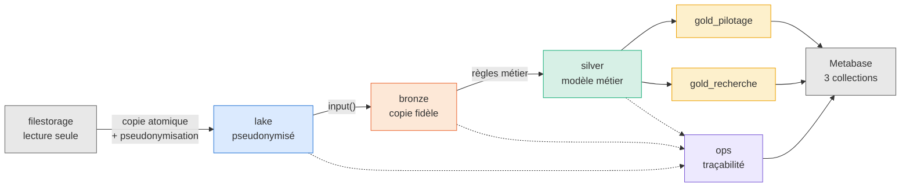
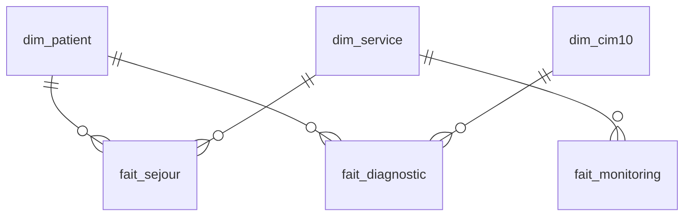
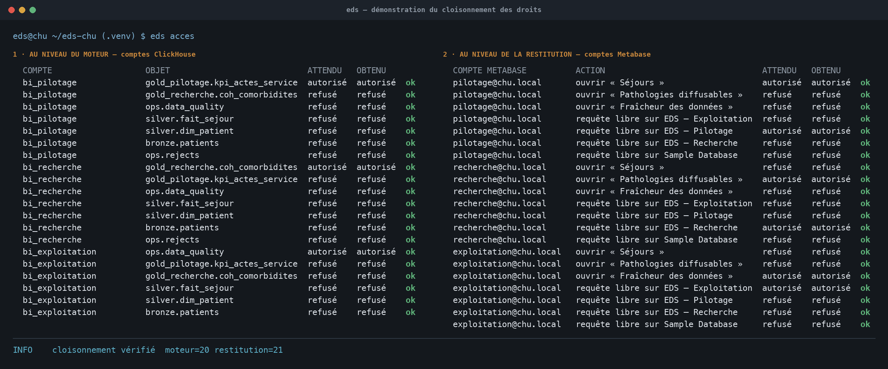
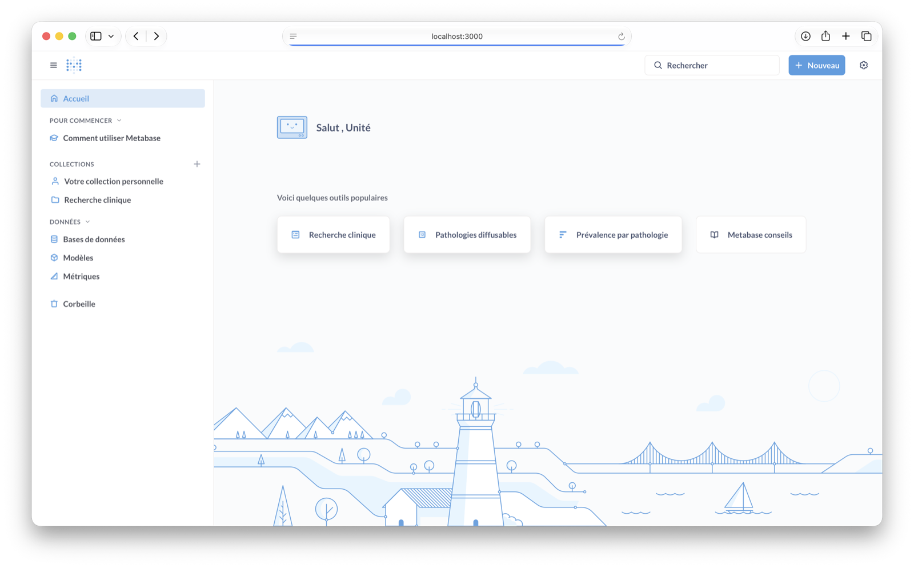
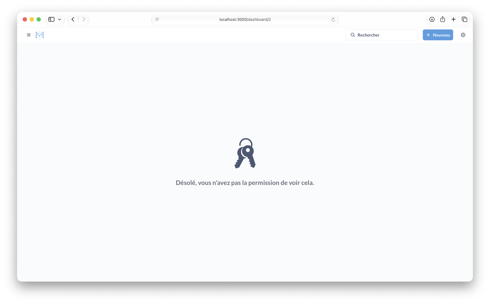
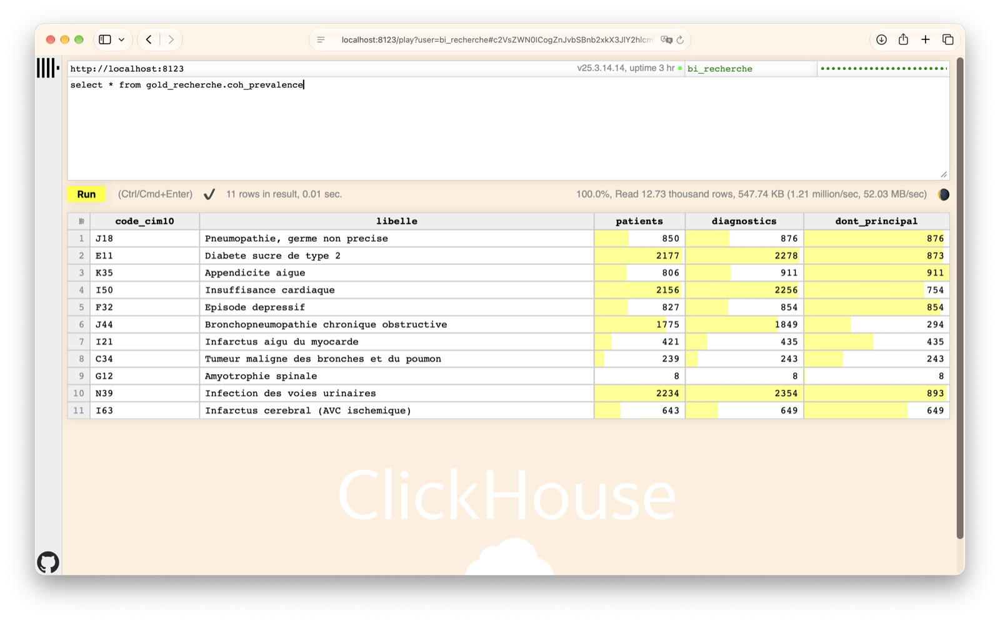
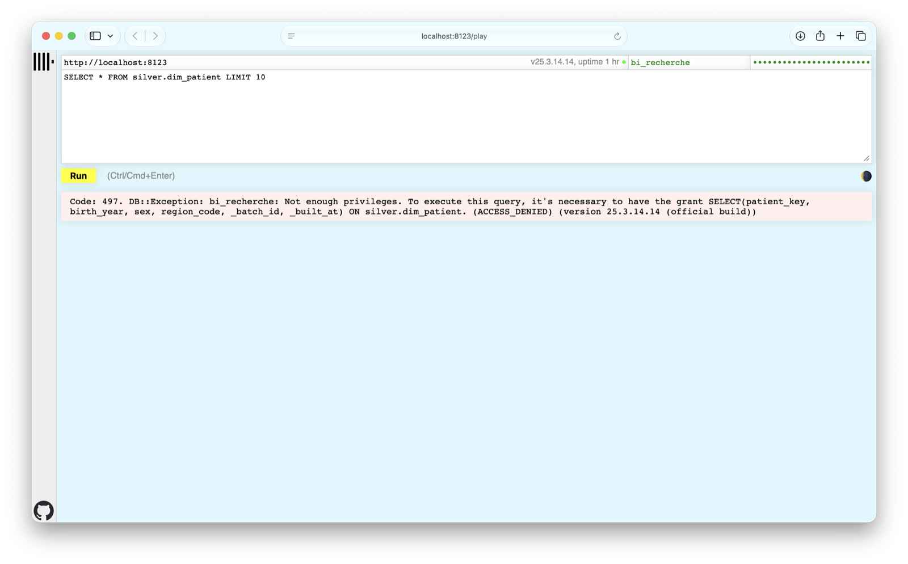
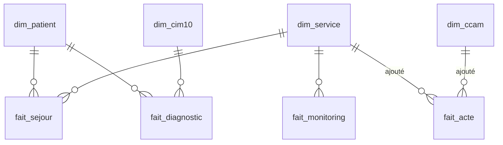

# Dossier de conception — Entrepôt de Données de Santé

CHU · Module Big Data M2 · Épreuve E05

Ce dossier expose le besoin, les choix d'architecture et ce qu'ils produisent.
Les chiffres qu'il cite sont établis et rejouables dans
[la validation des chiffres](VALIDATION.md) ; le lancement et la reprise sur
incident sont dans le [guide d'exploitation](EXPLOITATION.md).

- [Partie 1 — L'interface d'analyse](#partie-1--linterface-danalyse)
  - [1. Le besoin](#1-le-besoin)
  - [2. Les sources](#2-les-sources)
  - [3. L'architecture](#3-larchitecture)
  - [4. Les traitements](#4-les-traitements)
  - [5. Les indicateurs](#5-les-indicateurs)
  - [6. Les visualisations](#6-les-visualisations)
  - [7. Limites et recommandations](#7-limites-et-recommandations)
- [Partie 2 — L'évolution demandée par le CHU](#partie-2--lévolution-demandée-par-le-chu)
  - [8. La demande](#8-la-demande)
  - [9. Ce qui a changé, ce qui n'a pas bougé](#9-ce-qui-a-changé-ce-qui-na-pas-bougé)
  - [10. Les deux pièges](#10-les-deux-pièges)
  - [11. Les nouveaux indicateurs](#11-les-nouveaux-indicateurs)

---

# Partie 1 — L'interface d'analyse

> Cette partie décrit l'entrepôt **tel qu'il a été livré initialement**, sur les
> cinq flux du sujet. Le CHU a demandé ensuite une évolution : elle fait l'objet
> de la [partie 2](#partie-2--lévolution-demandée-par-le-chu), qui s'ajoute à
> celle-ci sans la remplacer. Les deux étapes sont tenues séparées pour qu'on
> voie ce que chacune a coûté.

## 1. Le besoin

La direction du CHU veut tirer deux usages de données aujourd'hui éparpillées
entre le dossier patient, les urgences, le laboratoire et le monitoring des
chambres. Ces deux usages ne se ressemblent pas, et c'est le fait structurant du
projet.

| | Pilotage hospitalier | Recherche clinique |
|---|---|---|
| **question** | comment tourne l'hôpital ? | que nous apprennent les pathologies ? |
| **grain** | le service, la journée | la cohorte |
| **fraîcheur** | quotidienne | indifférente |
| **ce qu'il faut voir** | activité, durées, occupation, alertes | prévalence, âge, sexe, comorbidités |
| **ce qu'il ne doit PAS voir** | rien de nominatif | rien d'opérationnel, ni petit effectif |

Le pilotage a besoin du détail par service et par jour ; la recherche n'en a pas
l'usage et ne doit pas y accéder. Inversement, la recherche croise âge, sexe et
pathologie — précisément les combinaisons qui ré-identifient. **Servir les deux
depuis une base unique reviendrait à donner à chacun les données de l'autre.**

S'y ajoute une contrainte qui n'est pas négociable : ce sont des données de santé
au sens de l'article 9 du RGPD. La conformité n'est pas une couche posée à la
fin, c'est une contrainte de conception à chaque étape.

## 2. Les sources

Le CHU dépose ses fichiers dans un espace en **lecture seule**. Cinq flux
déclarés — six tables une fois les référentiels éclatés — trois formats, et
chacun son calendrier. Ce dernier point compte : parcourir les dates d'un flux
pour en lire un autre n'en lirait qu'une partie, sans erreur visible.

| flux | format | dépôts | volume |
|---|---|---:|---:|
| `patients` | CSV | 3 | 18 000 lignes → 6 000 patients |
| `sejours` | CSV | 28 | 6 797 séjours |
| `diagnostics` | JSON imbriqué | 28 | 12 720 codes CIM-10 |
| `monitoring` | Parquet | 28 | 41 778 relevés |
| `referentiels` | CSV | 1 | 8 services, 13 codes CIM-10 |

89 fichiers au total, 3,2 Mo.

**`patients.csv` contient l'identité réelle** : `nir`, `nom`, `prenom`,
`birth_date`, et un `patient_id` en clair. Ces colonnes ne doivent jamais entrer
dans l'entrepôt. C'est la contrainte qui commande toute l'entrée de la chaîne.

Les fichiers sont versionnés dans `source-filestorage/` à la demande du
commanditaire, qui a confirmé par écrit qu'ils sont synthétiques. Le pipeline les
traite néanmoins comme s'ils étaient réels.

## 3. L'architecture



### Pourquoi un lake, puisque bronze existe déjà

Parce que **la pseudonymisation doit avoir lieu avant tout stockage durable**. Le
lake est la première zone que nous maîtrisons ; c'est donc là, et pas plus loin,
que l'identité disparaît. Bronze reçoit ensuite une copie déjà anonyme, ce qui
rend la garantie vérifiable : aucune requête sur l'entrepôt ne peut exhiber un
nom, puisqu'aucun nom n'y est jamais entré.

Le lake sert aussi de point de reprise. Si une transformation est fausse, on
rejoue depuis le lake sans redemander quoi que ce soit au CHU.

### Pourquoi quatre couches, et pas deux

Chaque couche a **une seule responsabilité**, et c'est ce qui rend une panne
localisable :

| couche | responsabilité | ce qu'elle ne fait pas |
|---|---|---|
| **lake** | copier fidèlement, pseudonymiser | interpréter |
| **bronze** | typer, sans juger | corriger |
| **silver** | appliquer les règles métier | servir des indicateurs |
| **gold** | servir un usage, cloisonné | contenir la vérité |

Bronze reproduit la source **ligne pour ligne** sur les neuf tables — c'est
vérifié à chaque exécution. Un écart entre la source et un indicateur se localise
donc immédiatement : soit la copie, soit une règle, jamais les deux à la fois.

### Pourquoi ClickHouse, et ELT plutôt qu'ETL

Le flux volumineux est le monitoring : 41 778 relevés ici, mais des dizaines de
millions dans un vrai CHU. Un moteur colonne orienté agrégats est le bon outil, et
il apporte un point décisif pour ce projet : **le cloisonnement est imposé par le
moteur**, pas par l'application. Un compte qui n'a pas le droit de lire une base
ne la lit pas, quelle que soit la requête qu'il écrit.

Le corollaire est un principe tenu partout : **Python pilote, le moteur
transforme.** Les données ne transitent jamais par un `DataFrame` — bronze est
alimentée par la fonction `input()` de ClickHouse, qui lit le fichier avec un
schéma déclaré. `silver.py` et `gold.py` font chacun une trentaine de lignes en
face de plusieurs centaines de SQL : c'est la preuve que le calcul est resté dans
le moteur.

### Pourquoi deux bases gold

Parce que le cloisonnement ne se délègue pas à une clause `WHERE`. Trois usages,
trois bases, trois comptes en lecture seule :

| usage | base | compte | voit |
|---|---|---|---|
| Pilotage | `gold_pilotage` | `bi_pilotage` | indicateurs agrégés |
| Recherche | `gold_recherche` | `bi_recherche` | vues de cohortes, k ≥ 5 |
| Exploitation | `ops` | `bi_exploitation` | journal, qualité, rejets |

Les vues de recherche sont déclarées `SQL SECURITY DEFINER` : elles s'exécutent
avec les droits de leur créateur, si bien qu'un compte de recherche **ne peut pas
contourner le seuil** en interrogeant directement silver — il n'y a pas accès.
`eds acces` en fait la démonstration par **41 contrôles**, moteur et restitution.

## 4. Les traitements

### La pseudonymisation, à l'entrée du lake

C'est le bonus du sujet, et il commande le reste. Trois opérations, déclarées
dans `config/sources.yml` et nulle part ailleurs :

- **hachage déterministe salé** — `patient_id` devient `patient_key`, un
  HMAC-SHA256 tronqué à 128 bits. Déterministe, donc les jointures survivent ;
  non réversible sans le sel, qui n'est pas versionné.
- **généralisation** — `birth_date` devient `birth_year`. Une date de naissance
  complète est un quasi-identifiant ; l'année suffit aux tranches d'âge.
- **suppression** — `nir`, `nom`, `prenom` et `patient_id` ne sont jamais écrits.

La politique est **déclarative et centralisée** : c'est la pièce à produire pour
justifier « aucune donnée identifiante n'entre ». Un contrôle de configuration
refuse d'exposer une colonne déclarée supprimée, et un crochet `pre-commit`
interdit qu'une donnée identifiante entre dans le dépôt Git.

### Rejeter ou signaler : la décision qui structure silver

Rejeter une ligne, c'est décider qu'elle est fausse. Toutes ne le sont pas.

| | REJET | SIGNALEMENT |
|---|---|---|
| **la valeur est** | fausse | vraie, mais gênante |
| **exemple** | FC à 0 bpm : le capteur ment | patient réadmis après un décès |
| **la ligne est** | écartée dans `ops.rejects` | conservée et marquée |

La distinction est structurante sur le monitoring : une valeur **hors bornes
physiologiques** est fausse et sort ; une valeur **hors seuils cliniques** est
vraie mais mauvaise pour le patient, elle reste et devient une alerte. Les
confondre reviendrait à supprimer les patients qui vont mal.

Onze contrôles alimentent `ops.data_quality` à chaque exécution : **deux règles
de rejet** — sortie antérieure à l'admission, fréquence cardiaque hors bornes —
et **neuf signalements**. Le déséquilibre est voulu : on écarte le moins
possible, on compte tout.

Deux de ces signalements valent zéro sur le jeu livré, et **les contrôles restent
en place**. Une livraison antérieure présentait 53,7 % de séjours chevauchants et
14,4 % de modes de sortie manquants ; la mesure est ce qui a permis de le dire.
La supprimer parce qu'elle affiche zéro rendrait indistinguables « aucune
anomalie » et « plus personne ne regarde ».

Aucune ligne ne disparaît sans être comptée : l'équation
`source = silver + rejets + doublons` se ferme sur les six tables, et un outil
la rejoue à la demande.

### Le modèle : une constellation, pas un flocon

Silver porte trois tables de faits et trois dimensions conformes :



`dim_service` et `dim_patient` sont partagées par deux faits chacune : c'est ce
qui autorise à comparer un service sur son activité et sur ses constantes sans
recoller des tables entre elles. C'est aussi ce qui a permis à l'évolution de
brancher un quatrième fait sans toucher au modèle.

**Il n'y a pas de `dim_date`.** Une table de dates n'apporterait ici qu'un
`JOIN` de plus : le moteur sait extraire mois et jour d'un horodatage, et
`WITH FILL` comble les journées sans activité. Une `dim_date` se justifierait
avec un calendrier métier — jours fériés, périodes budgétaires — que le CHU ne
fournit pas.

`fait_monitoring` porte un `service_code` **dénormalisé** depuis le séjour. Ce
n'est pas une redondance mais la condition pour ne jamais joindre deux tables de
faits entre elles : une telle jointure multiplierait les lignes sans lever
d'erreur.

### La traçabilité

`ops` enregistre, à chaque exécution : le journal des runs, les lignes rejetées
avec leur règle, le bilan qualité, et **les paramètres utilisés**. On sait donc
toujours avec quels seuils un chiffre a été produit — condition pour qu'un
clinicien puisse les réviser sans casser l'historique.

## 5. Les indicateurs

**Pilotage** — sept indicateurs de synthèse, puis le détail par service et par
jour : durée moyenne de séjour, activité, passages aux urgences, occupation,
réadmission à 30 jours, alertes sur les constantes.

| indicateur | valeur |
|---|---:|
| séjours | 6 729 |
| patients hospitalisés | 5 949 |
| séjours en cours | 683 |
| durée moyenne de séjour | 5,15 j |
| réadmission à 30 jours | 12,89 % |
| relevés en alerte | 3 314 (8,1 %) |

**Recherche** — six vues de cohortes : prévalence, distribution par âge et par
sexe, durée par pathologie, comorbidités. Toutes appliquent un seuil de diffusion
de **k = 5 patients**.

Chacun de ces chiffres a été **recalculé à la main** depuis les fichiers bruts,
avec du code qui n'importe pas une ligne du pipeline, et confronté à la feuille
de réponses du commanditaire. Le détail est dans [VALIDATION.md](VALIDATION.md).

## 6. Les visualisations

Trois tableaux de bord Metabase, 22 cartes, une collection par usage.

| tableau de bord | public | cartes |
|---|---|---:|
| Pilotage hospitalier | direction, cadres de santé | 10 |
| Recherche clinique | unité de recherche | 7 |
| Exploitation du pipeline | équipe technique | 5 |

Metabase en édition communautaire n'exporte pas ses tableaux de bord : ils sont
donc **décrits dans `config/dashboards.yml`**, versionnés et reconstructibles à
l'identique par `eds metabase`.

Deux choix de lisibilité méritent d'être dits. Les tranches d'âge sont un axe
**ordonné** : elles utilisent une rampe d'une seule teinte, du clair au foncé —
seul codage qui reste lisible pour un daltonien, puisqu'il porte sur la clarté et
non sur la teinte. Cette contrainte a réduit le découpage de six à cinq tranches :
au-delà, l'écart de clarté entre les deux derniers pas devenait indistinguable.
Les séries catégorielles utilisent une palette validée, et les teintes qui
passent sous 3:1 de contraste affichent leurs valeurs, ce qui tient lieu de
second encodage.

### La démonstration du cloisonnement

`eds acces` la produit automatiquement : **41 contrôles**, chacun avec son
résultat attendu et son résultat obtenu.



Elle se vérifie aussi à l'écran, et à **deux étages indépendants**. Ce qui suit
montre le compte de recherche, `recherche@chu.local` / `bi_recherche`.

**Étage restitution — Metabase.** Il ne voit que sa collection ; le tableau de
bord Pilotage lui est refusé.

| ce qu'il voit | ce qui lui est refusé |
|---|---|
|  |  |

**Étage moteur — ClickHouse.** C'est le contrôle qui compte vraiment : même en
écrivant sa propre requête, le compte de recherche ne peut pas contourner le
seuil de diffusion. La vue de cohortes lui est ouverte, la table silver qui
l'alimente lui est fermée.

| `gold_recherche.coh_prevalence` — autorisé | `silver.dim_patient` — refusé |
|---|---|
|  |  |

La capture de gauche montre le **seuil de diffusion à l'œuvre** : 11 pathologies
sont renvoyées alors que le référentiel en compte 13. `G12` passe avec ses
8 patients ; `E84` (4 patients) et `Q90` (3) sont supprimées. Personne n'a eu à
le demander — c'est la vue qui l'impose.

Celle de droite est la garantie que ce seuil ne se contourne pas :

```
Code: 497. bi_recherche: Not enough privileges. […] ON silver.dim_patient.
(ACCESS_DENIED)
```

Le refus vient du **moteur**, pas de l'application. Une clause `WHERE` oubliée
dans une vue ne pourrait pas ouvrir cette porte.

## 7. Limites et recommandations

### Ce que l'entrepôt ne montre pas

**51 patients n'apparaissent dans aucun indicateur de pilotage** : leur unique
séjour porte une date de sortie antérieure à l'admission et a été écarté. Leur
information clinique survit — ils sont dans `fait_diagnostic` avec 94 codes —
mais leur séjour non. La limite est mesurée, l'alternative chiffrée, et le choix
réversible : voir
[VALIDATION.md § Les 51 patients sans séjour](VALIDATION.md#les-51-patients-sans-séjour).

### Ce qui demande une relecture médicale

Trois définitions ont été choisies par des informaticiens :

1. **les seuils d'alerte**, fournis par le commanditaire, et qui tombent dans des
   plages vides des données — le décompte n'y est donc pas sensible ;
2. **la fenêtre de réadmission à 30 jours** et les sorties qu'elle exclut ;
3. **les cinq tranches d'âge**, dont le découpage sert autant la lisibilité que
   la pertinence épidémiologique.

### Ce qui appartient aux données, pas au pipeline

133 admissions postérieures à un décès subsistent dans le jeu livré. Elles sont
signalées, jamais corrigées en silence : la réponse correcte est de les remonter
à l'émetteur, et en attendant de les afficher.

### Ce qu'une mise en production changerait

- **Hébergement HDS.** Des données de santé nominatives imposent un hébergeur
  certifié. Le projet y est préparé : `CLICKHOUSE_SECURE` bascule la liaison en
  TLS sans toucher au code, et `EDS_SOURCE_PATH` désigne la source. Le
  `source-filestorage/` versionné ici n'aurait pas sa place en production.
- **Le sel de pseudonymisation** doit vivre dans un coffre, non dans un fichier
  `.env` : il est aujourd'hui non versionné, ce qui est le minimum, pas la cible.
- **La reconstruction intégrale** de silver et gold à chaque exécution tient à
  cette volumétrie. À l'échelle réelle, il faudrait reconstruire par partition.
- **Une `dim_date`** deviendrait utile dès que le CHU fournirait son calendrier
  métier.
- **La durée de conservation** n'est pas implémentée : le RGPD impose de la
  définir, et une politique de purge devrait accompagner l'entrepôt.

---

# Partie 2 — L'évolution demandée par le CHU

> Cette partie **s'ajoute** à la partie 1. Tout ce qui y est décrit — les cinq
> flux, les trois faits, les vingt-deux cartes — reste en place et continue de
> produire les mêmes chiffres. C'est précisément ce que le CHU demandait :
> *faire évoluer sans tout refaire, et sans rien casser.*

## 8. La demande

Le CHU a déposé, le **2026-08-29**, un dépôt supplémentaire : une description
plus fine des services et un flux d'actes médicaux. La consigne était explicite —
faire évoluer le modèle existant, sans tout refaire et **sans rien casser**.

| fichier | contenu |
|---|---|
| `referentiels/2026-08-29/description_service.csv` | catégorie, capacité en lits, pôle |
| `referentiels/2026-08-29/ccam.csv` | 8 actes, avec leur tarif T2A |
| `actes/2026-08-29/actes.parquet` | 8 112 actes rattachés aux séjours |

Cinq indicateurs étaient demandés : activité et DMS par catégorie, actes par
service, actes par type, densité d'actes par lit, montant facturé.

## 9. Ce qui a changé, ce qui n'a pas bougé

**Le socle n'a pas bougé.** Sur 92 fichiers, le lake n'en a copié que **3** : les
89 de la partie 1 sont reconnus sur leur date et pas un octet n'en est relu. La
découverte teste l'existence de chaque fichier et ignore les dates où il manque,
si bien qu'un référentiel arrivant en cours de route s'ingère comme les autres —
aucune configuration particulière n'a été nécessaire.

Le coût de l'évolution, mesuré :

| | Partie 1 | après l'évolution | écart |
|---|---:|---:|---:|
| flux déclarés | 5 | 6 | +1 |
| fichiers source | 89 | 92 | +3 |
| tables bronze | 6 | 9 | +3 |
| dimensions silver | 3 | 4 | +1, une enrichie |
| faits silver | 3 | 4 | +1 |
| tables gold pilotage | 8 | 11 | +3 |
| contrôles qualité | 11 | 13 | +2 |
| cartes | 22 | 28 | +6 |
| **indicateurs de la partie 1** | — | — | **inchangés** |

Aucune table de la partie 1 n'a été supprimée ni redéfinie. `dim_service` est la
seule à changer de forme : elle **gagne** trois colonnes — catégorie, capacité en
lits, pôle — et un témoin `est_decrit`. Ses deux colonnes d'origine sont
intactes, si bien que les **cinq indicateurs qui s'appuyaient déjà sur elle** —
DMS par service, activité par jour, occupation, réadmission par service, alertes
par jour — continuent de fonctionner sans qu'une ligne de leur SQL ait changé.

C'est le bénéfice d'une **dimension conforme** : on l'enrichit par la droite, et
ce qui la lisait déjà continue de la lire.

Le modèle après évolution, la partie 1 en gris :



`dim_service` passe de deux à trois faits : c'est elle qui porte le rattachement
des actes, et c'est la raison pour laquelle aucune jointure entre deux faits
n'est nécessaire.

La hiérarchie **service → catégorie → pôle** est traitée comme trois niveaux
d'agrégation, non comme une redondance : elle permet de lire la même activité à
trois échelles.

## 10. Les deux pièges

Le sujet en signalait deux. Aucun des deux ne lève d'erreur quand on tombe
dedans : ils produisent seulement des chiffres faux, ce qui est pire. Les deux
sont désormais gardés par des tests — vérifiés en les cassant volontairement.

### Le référentiel de description est incomplet

Il décrit **7 services sur 8**. `NEURO` n'y figure pas, et c'est le deuxième
service en volume : 1 208 séjours, 1 471 actes, 393 850 € de facturation.

Un `INNER JOIN` l'aurait effacé de tous les indicateurs par catégorie **sans un
mot** — les totaux seraient restés cohérents entre eux, et faux. Le choix retenu :

- `LEFT JOIN`, le service reste dans la dimension ;
- sa catégorie et son pôle valent explicitement `non décrit`, **visibles sur les
  graphiques** plutôt qu'escamotés ;
- **`capacite_lits` reste `NULL`, jamais 0.** Un service non décrit n'a pas zéro
  lit, il a un nombre de lits inconnu. Écrire 0 diviserait par zéro dans la
  densité d'actes par lit.

La densité par lit est donc incalculable pour ce service, et la carte l'écarte
plutôt que de l'afficher à zéro — ce qui le ferait passer pour inactif. La
capacité d'une catégorie n'est de même renseignée que si **tous** ses services le
sont : une somme partielle se laisserait comparer aux autres sans dire qu'elle
est sous-estimée.

### Le service est porté par le séjour, pas par l'acte

`actes.parquet` ne contient que `stay_id`, `code_ccam` et `acte_ts`. Compter les
actes par service impose donc de remonter au séjour — sans relier deux tables de
faits.

Joindre `fait_acte` à `fait_sejour` multiplierait chaque séjour par son nombre
d'actes : **8 112 séjours au lieu de 6 729**, et aucune erreur ne se lèverait. La
solution est celle que le projet appliquait déjà au monitoring : `service_code`
est **dénormalisé sur `fait_acte`** à la construction. Quand deux comptes doivent
se rencontrer — actes par séjour — ils sont agrégés séparément puis rapprochés
sur une clé de dimension, jamais sur une ligne de fait.

## 11. Les nouveaux indicateurs

Trois des cinq partagent le **même grain**, un service. Ils tiennent donc dans
une seule table plutôt que dans trois presque identiques : le grain définit la
table, et le multiplier sans raison multiplierait les occasions de les voir
diverger.

| service | actes | lits | actes/lit | actes/séjour | T2A |
|---|---:|---:|---:|---:|---:|
| CARDIO | 1 935 | 30 | 64,5 | 1,21 | 521 655 € |
| URGENCES | 1 731 | 20 | 86,6 | 1,22 | 478 585 € |
| **NEURO** | 1 471 | *—* | *—* | 1,22 | 393 850 € |
| PNEUMO | 1 009 | 28 | 36,0 | 1,20 | 268 045 € |
| PEDIA | 598 | 22 | 27,2 | 1,19 | 171 165 € |
| CHIR | 564 | 40 | 14,1 | 1,18 | 147 145 € |
| REA | 563 | 16 | 35,2 | 1,21 | 154 740 € |
| ONCO | 241 | 35 | 6,9 | 1,14 | 64 265 € |

Les totaux se recoupent à trois endroits : 8 112 actes et 2 199 450 € se
retrouvent par service comme par type d'acte, et les 6 729 séjours par service
comme par catégorie.

**La non-régression est vérifiée par un test** : les sept indicateurs de synthèse
sont inchangés après l'évolution. C'est ce que le sujet exigeait, et c'est la
propriété qu'il aurait été le plus facile de perdre sans s'en apercevoir.
